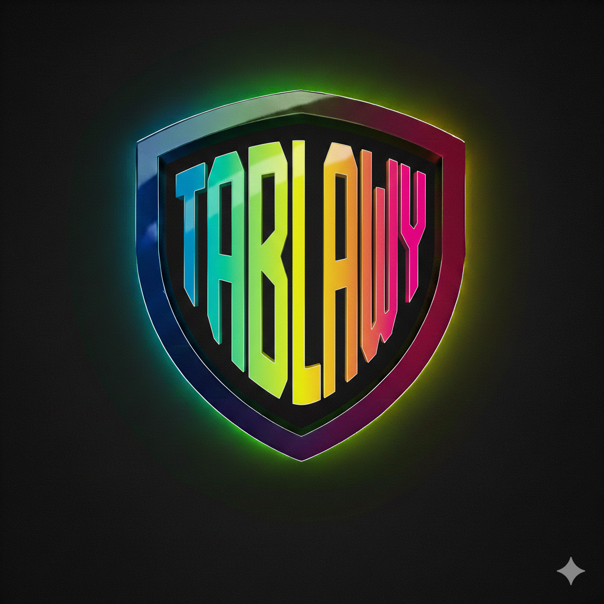

<div align="center">
  
  <h1>Frontend: Classroom Management System</h1>
</div>

This project contains the user interface for the classroom application, built with React, Refine, and Shadcn UI.

## 🚀 Tech Stack
*   **Framework:** React (Vite)
*   **Core Platform:** [Refine](https://refine.dev/) (v5)
*   **UI Library:** [shadcn/ui](https://ui.shadcn.com/) (Tailwind CSS v4)
*   **State Management:** TanStack Query (React Query)

## 🛠️ Setup & Installation
```bash
npm install
# Create a .env file with VITE_API_URL=http://localhost:8000/api
npm run dev      # Start server on port 5173
```

---

## 🔮 Future Roadmap

Here are the planned features for the next versions of the application:

### 📂 File Attachments
*   Allow teachers to attach PDFs or resources to assignments.
*   Allow students to upload files (Word, PDF, Images) as their submission.

### 🔔 Real-time Notifications
*   Notify students immediately when a new assignment is posted.
*   Notify students when their work has been graded.
*   Notify teachers when a student submits work late.

### 📊 Analytics Dashboard
*   **Teacher View:** Visual charts showing class average grades, submission rates, and grade distribution.
*   **Student View:** Progress tracking over time.

### 💬 Class Discussions
*   A comment section for each assignment where students can ask questions.
*   A general discussion board for the class.

### 📅 Calendar Integration
*   A visual calendar view showing all upcoming assignment due dates across all enrolled classes.
